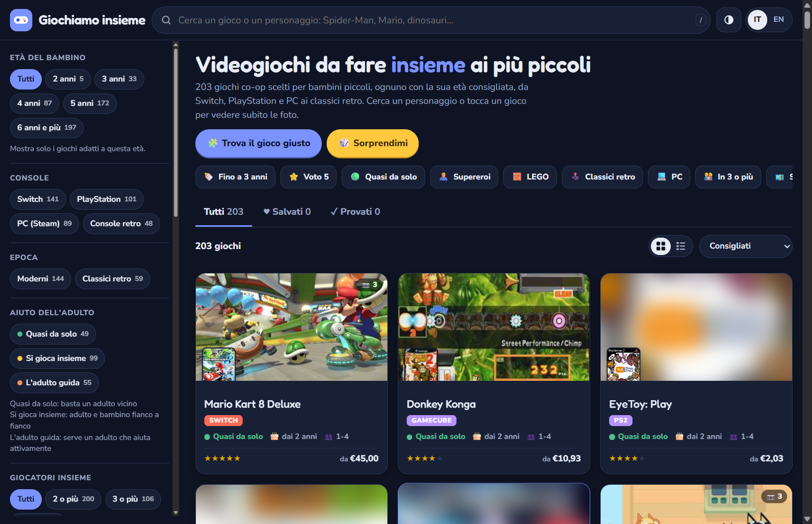

# Giochiamo insieme

Catalogo gratuito di videogiochi co-op da fare **insieme ai bambini piccoli**, sullo stesso schermo e senza online.

**▶ Apri l'app:** https://pipspinell.github.io/giochiamo-insieme/

## Cosa c'è

- circa 200 giochi co-op in locale per Switch, PlayStation, PC (Steam) e console retro
- per ogni gioco: età consigliata, quanto deve aiutare l'adulto, cosa fa il bambino, foto del gameplay, prezzi
- ricerca per personaggio ("Spider-Man", "Bluey", "dinosauri"…)
- un quiz di 7 domande che propone i giochi più adatti
- filtri per età, console, genere, personaggi, prezzo
- italiano e inglese, funziona anche offline
- nessun dato raccolto: preferiti e giochi provati restano sul tuo dispositivo

## Come usarla

- **Dal browser:** apri il link qui sopra, su computer, tablet o telefono.
- **Offline:** scarica `index.html` e aprilo con il browser.
- **Programma per Windows:** nella sezione [Releases](../../releases). Windows può mostrare l'avviso "app non riconosciuta" perché il programma non è firmato: "Ulteriori informazioni" → "Esegui comunque".

## Come è stata fatta

Non sono un programmatore: l'app è stata scritta da **Claude** (l'AI di Anthropic, tramite Claude Code). Io ho dato le idee, l'ho provata e ho segnalato cosa non andava. Anche la raccolta di prezzi, foto e informazioni è stata fatta da Claude in automatico, consultando gli store.

## Da sapere

- Età, valutazioni e descrizioni sono indicative: se trovi errori o vuoi suggerire un gioco, apri una segnalazione nella sezione Issues.
- Prezzi controllati a settembre 2026 (eShop, Steam, DekuDeals, PriceCharting): cambiano spesso.
- Copertine, screenshot e marchi appartengono ai rispettivi proprietari. Progetto gratuito e senza scopo di lucro.

---

**English:** a free catalogue of local co-op video games to play with young kids (ages 2–6): recommended age, gameplay photos, prices, character search and a 7-question quiz. Works offline, collects no data. Built with Claude (Anthropic's AI) via Claude Code.
