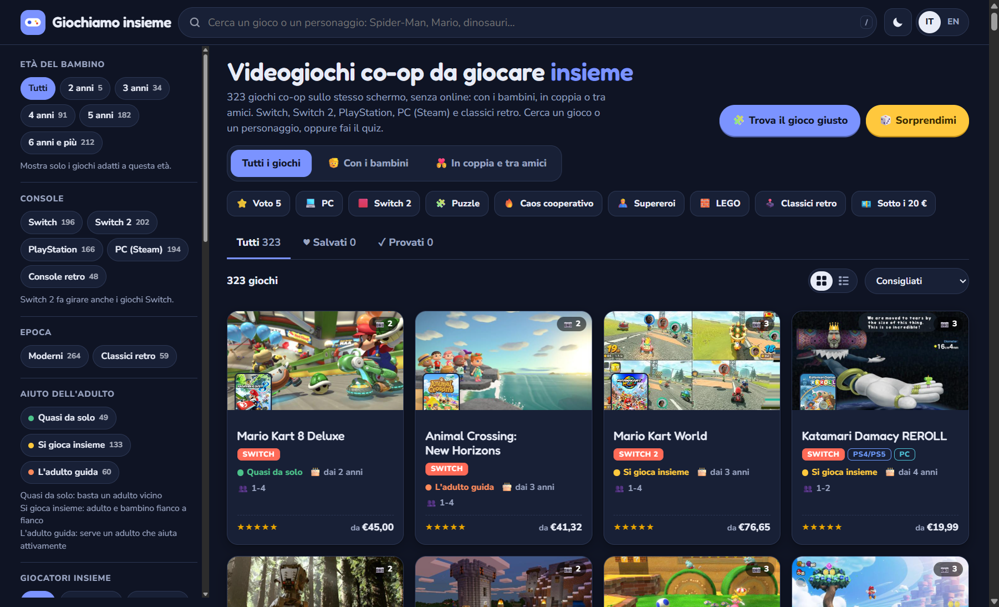

# Giochiamo insieme

Catalogo gratuito di videogiochi **co-op sullo stesso schermo**, senza online: da giocare con i bambini, in coppia o tra amici.

**▶ Apri l'app:** https://pipspinell.github.io/giochiamo-insieme/

## Cosa c'è

- quasi 300 giochi co-op in locale per Switch, Switch 2, PlayStation, PC (Steam) e console retro
- in alto scegli **Con i bambini** oppure **In coppia e tra amici**: cambiano giochi, filtri e ordine
- per ogni gioco: foto del gameplay in alta qualità, prezzi, età consigliata, come si gioca insieme, quanto piace ai grandi
- ricerca per titolo o personaggio ("Spider-Man", "Bluey", "dinosauri"…)
- un quiz di poche domande che propone i giochi più adatti (anche per coppie e gruppi di amici)
- italiano e inglese, funziona anche offline
- nessun dato raccolto: preferiti e giochi provati restano sul tuo dispositivo

## Sempre aggiornata

- **Prezzi:** ogni lunedì un robot gratuito di GitHub rilegge eShop, Steam, DekuDeals e PriceCharting e aggiorna i prezzi.
- **Giochi nuovi:** quando la libreria cresce, il sito si aggiorna; anche il file offline e il programma per Windows scaricano da soli i giochi nuovi quando c'è internet.

## Come usarla

- **Dal browser:** apri il link qui sopra, su computer, tablet o telefono.
- **Offline:** scarica `Giochiamo-insieme.html` e aprilo con il browser (con internet mostra anche le foto grandi e i prezzi aggiornati).
- **Programma per Windows:** nella sezione [Releases](../../releases). Windows può mostrare l'avviso "app non riconosciuta" perché il programma non è firmato: "Ulteriori informazioni" → "Esegui comunque".

## Come è stata fatta

Non sono un programmatore: l'app è stata scritta da **Claude** (l'AI di Anthropic, tramite Claude Code). Io ho dato le idee, l'ho provata e ho segnalato cosa non andava. Anche la raccolta di prezzi, foto e informazioni è stata fatta da Claude in automatico, consultando gli store; il robot dei prezzi è uno script nella cartella `strumenti/`.

## Da sapere

- Età, valutazioni e descrizioni sono indicative: se trovi errori o vuoi suggerire un gioco, apri una segnalazione nella sezione Issues.
- Sono inclusi solo giochi con co-op nella stessa stanza; per il PC solo quelli che Steam indica per più giocatori sullo stesso schermo.
- Copertine, screenshot e marchi appartengono ai rispettivi proprietari. Progetto gratuito e senza scopo di lucro.

---

**English:** a free catalogue of same-screen co-op video games, no online needed: for playing with kids, as a couple or with friends. Gameplay photos, weekly auto-updated prices, recommended ages, character search and a short quiz. Works offline, collects no data. Built with Claude (Anthropic's AI) via Claude Code.
